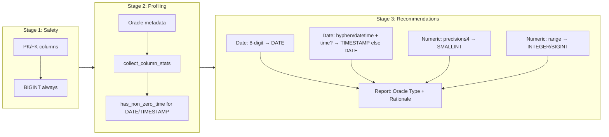
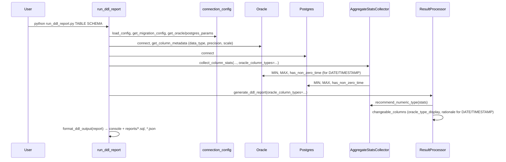

# Oracle → PostgreSQL Migration & Validation System Architecture

> **Purpose**: Overall structure and workflow at a glance.  
> **Audience**: Project managers, new team members. **Detailed API**: See `ARCHITECTURE.md`.

---

## 1. System Overview

Integrated tool for **table creation**, **data migration**, **data validation**, and **DDL recommendation** from Oracle to PostgreSQL.  
**Core value**: Validation-based migration decision engine + intelligent type recommendations (date/time, numeric, PK/FK).

- **Entry points**: `run_ddl_report.py` (DDL report only), `db_sync_tool.py` (tables), `data_migrator.py` (migration), `run_validation.py` (validation)
- **Config**: Single source **config.yaml** via **config/connection_config.py** (no hardcoded ports/schemas/tables)
- **Reports**: All under **reports/** — `.sql`, `.json`, summary, aggregate, DDL

---

## 2. High-Level Architecture Diagram

```
┌─────────────────────────────────────────────────────────────────────────────┐
│  User                                                                         │
│  run_ddl_report [TABLE] [SCHEMA] | run_validation | data_migrator | db_sync  │
└─────────────────────────────────────────────────────────────────────────────┘
                                      │
                                      ▼
┌─────────────────────────────────────────────────────────────────────────────┐
│  config.yaml  (single source: oracle, postgres, migration, validation)        │
│  config/connection_config.py  (load_config, get_*_params, get_*_config)       │
└─────────────────────────────────────────────────────────────────────────────┘
        │                    │                    │                    │
        ▼                    ▼                    ▼                    ▼
┌──────────────┐    ┌──────────────┐    ┌──────────────┐    ┌──────────────┐
│run_ddl_report│    │run_validation│    │data_migrator │    │db_sync_tool  │
│              │    │              │    │              │    │              │
│ Oracle+PG    │    │ Validation   │    │ Keyset       │    │ Oracle meta  │
│ metadata +   │    │ Engine       │    │ Pagination   │    │ → CREATE TABLE│
│ stats → DDL  │    │ → Aggregate  │    │ → Chunk Hash │    │ + PK         │
│ report       │    │ → Chunk Hash │    │ → Aggregate  │    │              │
│ → reports/   │    │ → DDL report │    │              │    │              │
│   .sql .json │    │ → reports/   │    │              │    │              │
└──────┬───────┘    └──────┬───────┘    └──────┬───────┘    └──────┬───────┘
       │                   │                   │                   │
       └───────────────────┴───────────────────┴───────────────────┘
                                      │
        ┌─────────────────────────────┼─────────────────────────────┐
        ▼                             ▼                             ▼
┌───────────────┐           ┌───────────────┐           ┌───────────────┐
│ DB Layer      │           │ Check Layer   │           │ Core          │
│ oracle.py     │           │ aggregate.py   │           │ engine.py     │
│ postgres.py   │           │ chunk_hash.py  │           │ result.py     │
│ chunk_        │           │ aggregate_    │           │ report.py     │
│ strategy.py   │           │ validation.py  │           │               │
└───────────────┘           └───────────────┘           └───────────────┘
```

---

## 3. Intelligent DDL Recommendation Pipeline (3 Stages)



**Logic summary**

| Rule | Application |
|------|-------------|
| PK/FK | Always BIGINT (no SMALLINT/INTEGER downcast). |
| 8-digit integer (YYYYMMDD) | Treat as date-only → recommend DATE. |
| Hyphen/datetime + has_non_zero_time | Any row with time ≠ 00:00:00 → TIMESTAMP; else DATE. |
| precision ≤ 4 (scale 0) | SMALLINT (document PAGE 2). |
| Data range | -32768..32767 → SMALLINT; INT range → INTEGER; else BIGINT. |
| Report | Every changeable column shows **Oracle Type**; DATE/TIMESTAMP columns show **Profiling Result**, **Recommended**, **Rationale**. |

**Validation and report additions**

| Item | Description |
|------|-------------|
| HAS_FRACTION | Direct query (`col != TRUNC(col)`) for fraction row count; report: `HAS_FRACTION: Y/N (fraction_row_count: N)`. |
| OUT_OF_RANGE | `count_out_of_range_rows` before SMALLINT/INTEGER; if any row exceeds range → no downcast, reason `OUT_OF_RANGE_VERIFIED`. |
| Dry-run CAST | `dry_run_cast_loss_count` on PG; report: `Dry-run CAST loss rows: N` for numeric_downcast_candidates. |
| FK | PK/FK auto-detected via `get_fk_columns`; always kept BIGINT. |
| Index | `get_indexed_columns` (DBA_INDEXES + DBA_IND_COLUMNS); report: `In index: Y/N`. |
| NULL / distinct ratio | `null_ratio`, `distinct_ratio`; report hints: "(code/flag candidate)", "(type change effect minimal)". |
| Table size | `get_pg_table_size_bytes` (pg_total_relation_size); report: `Table size (PG): X.XX MB`. |

---

## 4. Data Flow: run_ddl_report.py



---

## 5. Data Flow: run_validation.py (ValidationEngine)

```
1) Load config (validation section, chunk_size, tolerance, etc.)
2) Oracle + Postgres connect
3) For each table:
   a) Oracle get_column_metadata → oracle_precision, oracle_scale, oracle_column_types
   b) Phase 1: Aggregate (COUNT, MIN, MAX, DISTINCT, SUM, AVG) — Decimal + scale quantize
   c) Phase 2: Chunk Hash (canonicalization, SHA256, column names lower())
   d) Phase 3: Sampling on error chunks (row-by-row, max_diffs_per_chunk)
   e) DDL report: collect_column_stats(oracle_column_types) → recommend_numeric_type
                  → generate_ddl_report(oracle_column_types) → changeable_columns + numeric_downcast_candidates
   f) Reports: summary, JSON, aggregate, DDL (*.sql) under reports/
```

---

## 6. Reports Layout

| Source | Location | Contents |
|--------|----------|----------|
| run_ddl_report.py | reports/{schema}_{table}_ddl_{timestamp}.sql | Full DDL script; comments: Table size (PG), Oracle Type, HAS_FRACTION, In index, Distinct/Null ratio, Dry-run CAST loss rows |
| run_ddl_report.py | reports/{schema}_{table}_ddl_{timestamp}.json | Same report in JSON (metadata, ddl_statements, changeable_columns, numeric_downcast_candidates) |
| run_validation.py | reports/ | *_summary_*.txt, *.json, *_aggregate_*.json, *_ddl_*.sql (ReportGenerator default output_dir) |

---

## 7. Core Design Principles

| Principle | Content |
|-----------|---------|
| Single config | config.yaml only; connection_config.py; no hardcoded connection/schema/table. |
| Deterministic paging | No ROWNUM/OFFSET; Keyset Pagination only. |
| Normalization-based hash | Same rules and delimiter; Oracle AL32UTF8 + LOWER(RAWTOHEX); Postgres column names lower(). |
| Decimal / metric comparison | No float; aggregate: to_decimal → scale quantize → `==`. |
| Evidence-based DDL | Date/time → DATE vs TIMESTAMP by has_non_zero_time; numeric by precision/range; PK/FK always BIGINT. |
| Report clarity | Oracle Type for every changeable column; DATE/TIMESTAMP with Profiling Result and Rationale. |

---

## 8. Main Modules (Summary)

- **config/connection_config.py**: Load config.yaml; expose oracle/postgres/migration/validation params.
- **checks/aggregate.py**: collect_column_stats (has_non_zero_time, HAS_FRACTION via TRUNC, null_count); count_out_of_range_rows; dry_run_cast_loss_count; get_indexed_columns; get_pg_table_size_bytes; recommend_numeric_type (date 8-digit/hyphen, DATE vs TIMESTAMP, SMALLINT/INTEGER/BIGINT).
- **validator/core/result.py**: generate_ddl_report(oracle_column_types), format_ddl_output (Oracle Type + Rationale block for DATE/TIMESTAMP); map_oracle_number_to_postgres (precision≤4→SMALLINT); PK/FK→BIGINT in DDL.
- **validator/core/engine.py**: Orchestration; passes oracle_column_types into generate_ddl_report.
- **db/oracle.py, postgres.py**: Connection, queries, get_column_metadata (data_type, precision, scale).
- **checks/chunk_hash.py**: Canonicalization, column concat, Oracle/Postgres hash.
- **validator/core/report.py**: JSON/summary/aggregate reports; output_dir=reports.

---

## 9. Partition-Aware Validation

- **Purpose**: Efficient per-partition validation for large log/time-series tables.
- **Flow**: Oracle DBA_TAB_PARTITIONS + Postgres pg_inherits → per-partition strategy (old: COUNT+Hash; recent: Chunk Hash + limited drilldown) → reports.
- **Config**: validation_mode.type: partition_aware, partition_key, immutable_before.

---

## 10. Completed Improvements & Roadmap

**Completed**: Single config; run_ddl_report (DDL-only, --create, reports/*.sql and *.json); intelligent DDL pipeline (PK/FK BIGINT; date DATE/TIMESTAMP; precision≤4 SMALLINT; Oracle Type + Rationale); HAS_FRACTION (TRUNC); OUT_OF_RANGE verification; Dry-run CAST; index info; null/distinct ratio; table size; Keyset Pagination; Chunk Hash; Numeric Precision Decision; partition-aware validation.

**Roadmap**: Phase 2 (DDL recommendations and report format) done. Phase 3: Dashboard, scheduling, notifications.

---

*For implementation details and APIs, see `ARCHITECTURE.md`.*
