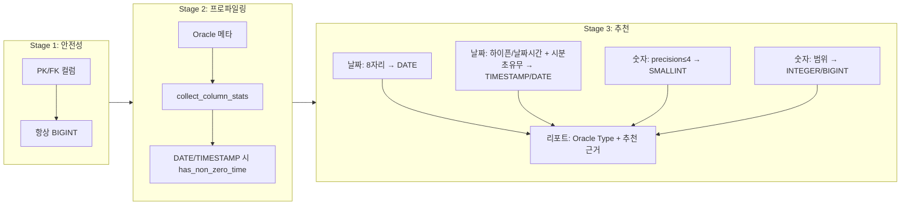
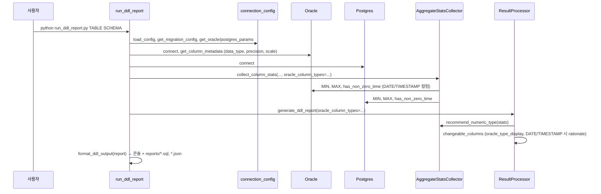

# Oracle → PostgreSQL 마이그레이션 및 검증 시스템 아키텍처

> **목적**: 전체 구조와 워크플로우를 한눈에 파악.  
> **대상**: 프로젝트 관리자, 신규 팀원. 상세 API/구현은 `ARCHITECTURE.md` 참조.

---

## 1. 시스템 개요

Oracle에서 PostgreSQL로 **테이블 생성**, **데이터 이관**, **데이터 검증**, **DDL 추천 리포트**를 수행하는 통합 도구다.  
**핵심 가치**: 검증 기반 마이그레이션 의사결정 + **지능형 타입 추천**(날짜/숫자/코드, PK·FK BIGINT).

- **진입점**: `run_ddl_report.py`(DDL 리포트 전용), `db_sync_tool.py`(테이블), `data_migrator.py`(이관), `run_validation.py`(검증)
- **설정**: 단일 소스 **config.yaml** + **config/connection_config.py** (접속·스키마·테이블 하드코딩 없음)
- **리포트**: 모두 **reports/** 아래 — `.sql`, `.json`, 요약, 집계, DDL

---

## 2. 전체 아키텍처 다이어그램

```
┌─────────────────────────────────────────────────────────────────────────────┐
│  사용자                                                                       │
│  run_ddl_report [테이블] [스키마] | run_validation | data_migrator | db_sync  │
└─────────────────────────────────────────────────────────────────────────────┘
                                      │
                                      ▼
┌─────────────────────────────────────────────────────────────────────────────┐
│  config.yaml  (단일 소스: oracle, postgres, migration, validation)           │
│  config/connection_config.py  (load_config, get_*_params, get_*_config)       │
└─────────────────────────────────────────────────────────────────────────────┘
        │                    │                    │                    │
        ▼                    ▼                    ▼                    ▼
┌──────────────┐    ┌──────────────┐    ┌──────────────┐    ┌──────────────┐
│run_ddl_report│    │run_validation│    │data_migrator │    │db_sync_tool  │
│              │    │              │    │              │    │              │
│ Oracle+PG    │    │ Validation   │    │ Keyset       │    │ Oracle 메타  │
│ 메타+통계 →  │    │ Engine       │    │ Pagination   │    │ → CREATE TABLE│
│ DDL 리포트   │    │ → 집계       │    │ → Chunk Hash │    │ + PK         │
│ → reports/   │    │ → Chunk Hash │    │ → 집계       │    │              │
│   .sql .json │    │ → DDL 리포트 │    │              │    │              │
└──────┬───────┘    └──────┬───────┘    └──────┬───────┘    └──────┬───────┘
       │                   │                   │                   │
       └───────────────────┴───────────────────┴───────────────────┘
                                      │
        ┌─────────────────────────────┼─────────────────────────────┐
        ▼                             ▼                             ▼
┌───────────────┐           ┌───────────────┐           ┌───────────────┐
│ DB Layer      │           │ Check Layer   │           │ Core          │
│ oracle.py     │           │ aggregate.py  │           │ engine.py     │
│ postgres.py   │           │ chunk_hash.py │           │ result.py     │
│ chunk_        │           │ aggregate_    │           │ report.py     │
│ strategy.py   │           │ validation.py │           │               │
└───────────────┘           └───────────────┘           └───────────────┘
```

---

## 3. 지능형 DDL 추천 파이프라인 (3단계)



**규칙 요약**

| 규칙 | 적용 |
|------|------|
| PK/FK | 항상 BIGINT (SMALLINT/INTEGER 다운캐스트 없음). |
| 8자리 정수 (YYYYMMDD) | 날짜 전용 → DATE 추천. |
| 하이픈/날짜시간 + has_non_zero_time | 한 행이라도 시분초 ≠ 00:00:00 → TIMESTAMP; 전부 00:00:00 → DATE. |
| precision ≤ 4 (scale 0) | SMALLINT (문서 PAGE 2). |
| 데이터 범위 | -32768..32767 → SMALLINT; INT 범위 → INTEGER; 그 외 → BIGINT. |
| 리포트 | 모든 changeable 컬럼에 **Oracle Type** 표시; DATE/TIMESTAMP 컬럼에 **Profiling Result**, **Recommended**, **Rationale** 표시. |

**검증 및 리포트 추가 항목**

| 항목 | 설명 |
|------|------|
| HAS_FRACTION | `col != TRUNC(col)` 직접 쿼리로 소수점 행 수 수집; 리포트: `HAS_FRACTION: Y/N (fraction_row_count: N)`. |
| OUT_OF_RANGE | SMALLINT/INTEGER 추천 전 `count_out_of_range_rows` 호출; 1건이라도 초과 시 다운캐스트 제외, 사유 `OUT_OF_RANGE_VERIFIED`. |
| Dry-run CAST | PG에서 `dry_run_cast_loss_count`; numeric_downcast_candidates에 `Dry-run CAST loss rows: N` 출력. |
| FK | `get_fk_columns`로 FK 자동 감지; 항상 BIGINT 유지. |
| 인덱스 | `get_indexed_columns`(DBA_INDEXES + DBA_IND_COLUMNS); 리포트: `In index: Y/N`. |
| NULL·distinct 비율 | `null_ratio`, `distinct_ratio`; 리포트 문구: "(code/flag candidate)", "(type change effect minimal)". |
| 테이블 크기 | `get_pg_table_size_bytes`(pg_total_relation_size); 리포트: `Table size (PG): X.XX MB`. |

---

## 4. 데이터 흐름: run_ddl_report.py



---

## 5. 데이터 흐름: run_validation.py (ValidationEngine)

```
1) config 로드 (validation 섹션, chunk_size, tolerance 등)
2) Oracle + Postgres 연결
3) 테이블별:
   a) Oracle get_column_metadata → oracle_precision, oracle_scale, oracle_column_types
   b) 1단계: 집계 (COUNT, MIN, MAX, DISTINCT, SUM, AVG) — Decimal + scale quantize
   c) 2단계: Chunk Hash (정규화, SHA256, 컬럼명 lower())
   d) 3단계: 오류 구간 샘플링 (row-by-row, max_diffs_per_chunk)
   e) DDL 리포트: collect_column_stats(oracle_column_types) → recommend_numeric_type
                  → generate_ddl_report(oracle_column_types) → changeable_columns + numeric_downcast_candidates
   f) 리포트: 요약, JSON, 집계, DDL (*.sql) → reports/
```

---

## 6. 리포트 구성

| 출처 | 위치 | 내용 |
|------|------|------|
| run_ddl_report.py | reports/{schema}_{table}_ddl_{timestamp}.sql | 전체 DDL 스크립트; 주석: Table size (PG), Oracle Type, HAS_FRACTION, In index, Distinct/Null ratio, Dry-run CAST loss rows |
| run_ddl_report.py | reports/{schema}_{table}_ddl_{timestamp}.json | 동일 리포트 JSON (metadata, ddl_statements, changeable_columns, numeric_downcast_candidates) |
| run_validation.py | reports/ | *_summary_*.txt, *.json, *_aggregate_*.json, *_ddl_*.sql (ReportGenerator 기본 output_dir) |

---

## 7. 핵심 설계 원칙 (통합)

| 원칙 | 내용 |
|------|------|
| 설정 단일 소스 | config.yaml + connection_config만 사용. |
| 결정적 페이징 | ROWNUM/OFFSET 금지. Keyset Pagination만. |
| 정규화 기반 해시 | Canonicalization 후 해시. Oracle/Postgres 동일 규칙·구분자·컬럼명 lower. |
| Decimal·metric 비교 | Float 금지. 집계는 to_decimal → scale quantize → `==`. |
| Evidence-based DDL | 날짜 → has_non_zero_time으로 DATE/TIMESTAMP; 숫자 → precision/범위; PK/FK 항상 BIGINT. |
| 리포트 명확성 | 모든 changeable 컬럼에 Oracle Type; DATE/TIMESTAMP에 Profiling Result·Rationale. |

---

## 8. 주요 모듈 (요약)

- **config/connection_config.py**: config.yaml 로드; oracle/postgres/migration/validation 설정 제공.
- **checks/aggregate.py**: collect_column_stats(has_non_zero_time, TRUNC 기반 HAS_FRACTION, null_count); count_out_of_range_rows; dry_run_cast_loss_count; get_indexed_columns; get_pg_table_size_bytes; recommend_numeric_type(8자리·하이픈 날짜, DATE vs TIMESTAMP, SMALLINT/INTEGER/BIGINT).
- **validator/core/result.py**: generate_ddl_report(oracle_column_types), format_ddl_output(Oracle Type·DATE/TIMESTAMP 추천 근거); map_oracle_number_to_postgres(precision≤4→SMALLINT); DDL에서 PK/FK→BIGINT.
- **validator/core/engine.py**: 오케스트레이션; generate_ddl_report에 oracle_column_types 전달.
- **db/oracle.py, postgres.py**: 연결, 쿼리, get_column_metadata(data_type, precision, scale).
- **checks/chunk_hash.py**: 정규화, 컬럼 결합, Oracle/Postgres 해시.
- **validator/core/report.py**: JSON·요약·집계 리포트; output_dir=reports.

---

## 9. 파티션 인식 검증

- **목적**: 로그/시계열 대용량 테이블을 파티션별로 효율 검증.
- **흐름**: Oracle DBA_TAB_PARTITIONS + Postgres pg_inherits → 파티션별 전략(오래된: COUNT+Hash; 최근: Chunk Hash + 제한적 drilldown) → 리포트.
- **설정**: validation_mode.type: partition_aware, partition_key, immutable_before.

---

## 10. 완료된 개선 및 로드맵

**완료**: 단일 config; run_ddl_report(DDL 전용, --create, reports/*.sql·*.json); 지능형 DDL 파이프라인(PK/FK BIGINT; DATE/TIMESTAMP; precision≤4 SMALLINT; Oracle Type·Rationale); HAS_FRACTION(TRUNC); OUT_OF_RANGE 검증; Dry-run CAST; 인덱스 정보; null/distinct 비율; 테이블 크기; Keyset Pagination; Chunk Hash; Numeric Precision Decision; 파티션 인식 검증.

**로드맵**: Phase 2(DDL 추천·리포트 형식) 완료. Phase 3: 대시보드·스케줄링·알림.

---

*상세 구현·API·설정 예시는 `ARCHITECTURE.md`를 참조하세요.*
